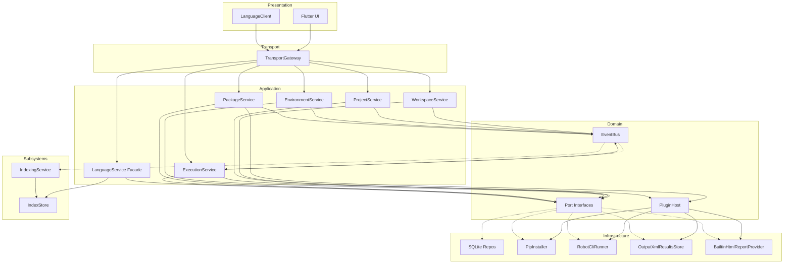
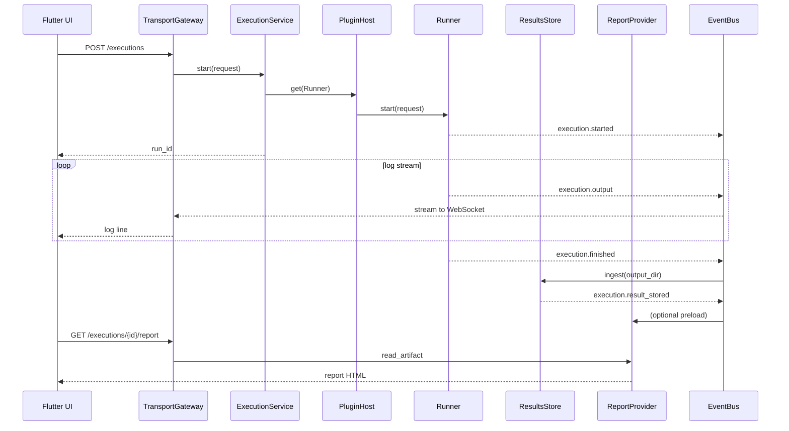
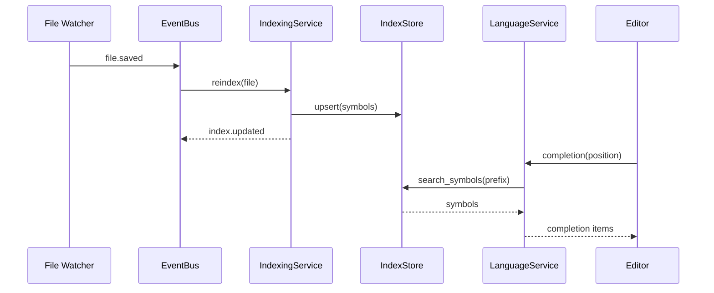

# Robot Studio — Architecture (v2)

> A cross-platform desktop IDE for Robot Framework development.

**Status:** M1 complete · Architecture revised before M2  
**Last updated:** Architecture review — Language Service, Event Bus, Plugin System, Indexing, Transport layer

---

## 1. Overview

Robot Studio follows **clean architecture** with a **Flutter Desktop** frontend and a **Python backend**. Modules communicate through **port interfaces** and an in-process **Event Bus**, not direct calls to concrete implementations. Core features (execution, reports, packages, AI) are designed to register through the same **Plugin Host** that third-party extensions will use later.

Persistent state lives in **SQLite**. Symbol intelligence (keywords, variables, libraries, references) is served by a dedicated **Indexing** subsystem consumed by the **Language Service**.

```
┌──────────────────────────────────────────────────────────────────────────┐
│                         Flutter Desktop (Presentation)                    │
│  Shell · Editor · Sidebar · Reports · Console · Language Client          │
└───────────────────────────────┬──────────────────────────────────────────┘
                                │
                    ┌───────────▼───────────┐
                    │   Transport Gateway    │  ← abstraction over REST / gRPC
                    │   (REST now, gRPC later)│
                    └───────────┬───────────┘
                                │
┌───────────────────────────────▼──────────────────────────────────────────┐
│                          API / Protocol Adapters                          │
└───────────────────────────────┬──────────────────────────────────────────┘
                                │
┌───────────────────────────────▼──────────────────────────────────────────┐
│                     Application Services (Use Cases)                      │
│         orchestrate ports · publish/subscribe via Event Bus               │
└───────────────────────────────┬──────────────────────────────────────────┘
                                │
         ┌──────────────────────┼──────────────────────┐
         │                      │                      │
┌────────▼────────┐   ┌────────▼────────┐   ┌────────▼────────┐
│     Domain      │   │   Event Bus     │   │  Plugin Host    │
│ Entities+Ports  │   │  (in-process)   │   │  (capability    │
│                 │   │                 │   │   registry)     │
└────────┬────────┘   └────────┬────────┘   └────────┬────────┘
         │                      │                      │
┌────────▼──────────────────────▼──────────────────────▼──────────────────┐
│                          Infrastructure                                   │
│  SQLite · Index Store · venv · PipInstaller · RobotRunner · ReportLens   │
└──────────────────────────────────────────────────────────────────────────┘
```

### Design principles

| Principle | Application |
|-----------|-------------|
| **Ports & adapters** | Every external capability (pip, robot CLI, libdoc, PyPI) sits behind an interface |
| **Event-driven decoupling** | Modules react to lifecycle events instead of calling each other directly |
| **Plugin-ready core** | Built-in features implement the same capability interfaces as future plugins |
| **Index-backed intelligence** | Language Service reads from Indexing; never scans the filesystem ad hoc |
| **Transport abstraction** | Frontend depends on a gateway contract, not HTTP or gRPC specifically |

---

## 2. Cross-Cutting Subsystems

These are not "features" in the UI sense — they underpin multiple modules.

### 2.1 Event Bus

An **in-process publish/subscribe bus** on the backend decouples modules that today would otherwise import each other directly.

```
Publisher                  Event                        Subscribers
─────────                  ─────                        ───────────
WorkspaceService    →  workspace.opened          →  IndexingService (rebuild)
EnvironmentService  →  environment.activated     →  IndexingService, PackageService
PackageService      →  package.installed         →  IndexingService (re-index libs)
IndexingService     →  index.updated             →  LanguageService (invalidate cache)
Runner              →  execution.started       →  ResultsService, UI stream
Runner              →  execution.output        →  UI stream (via gateway)
ResultsService      →  execution.finished      →  ReportProvider, history store
PluginHost          →  plugin.loaded             →  Event Bus (register handlers)
```

**Contract:**

```python
class EventBus(ABC):
    async def publish(self, event: DomainEvent) -> None: ...
    def subscribe(self, event_type: type[DomainEvent], handler: EventHandler) -> Subscription: ...
```

**Rules:**

- Application services **publish** events after successful state changes.
- Subscribers **must not** call back into the publisher synchronously (avoid cycles).
- Subscribers may schedule async work (e.g. index rebuild) on a background task queue.
- The frontend does **not** connect to the Event Bus directly — it receives a **filtered event stream** through the Transport Gateway (WebSocket initially, gRPC stream later).

**Why not direct dependencies?**

Installing a package should not require `PackageService` to know about `IndexingService`. The `package.installed` event lets Indexing react independently. Same for execution finishing → report generation, environment change → cache invalidation.

---

### 2.2 Plugin System

Core features and third-party extensions share one **capability registry**.

```
┌─────────────────────────────────────────────────────────┐
│                      Plugin Host                         │
│  discover · load · activate · capability routing         │
└────────────┬────────────────────────────────────────────┘
             │ registers
   ┌─────────┼─────────┬─────────────┬──────────────┐
   ▼         ▼         ▼             ▼              ▼
Runner   ReportProv  Installer   LanguageService   AIProvider
(builtin) (builtin)  (pip builtin) (builtin)      (plugin)
```

**Plugin manifest** (TOML/JSON):

```toml
[plugin]
id = "reportlens"
version = "1.0.0"
name = "ReportLens Integration"

[provides]
report-provider = "reportlens.plugin:ReportLensProvider"
```

**Capability interfaces** (plugins implement one or more):

| Capability | Interface | Built-in default |
|------------|-----------|------------------|
| Test runner | `Runner` | `RobotCliRunner` |
| Results parser | `ResultsStore` | `OutputXmlResultsStore` |
| Report viewer | `ReportProvider` | `BuiltinHtmlReportProvider` |
| Package installer | `Installer` | `PipInstaller` |
| Language intelligence | `LanguageService` | `RobotLanguageService` |
| AI assistant | `AIProvider` | none (plugin only at first) |

**Loading phases:**

| Phase | Scope |
|-------|-------|
| **P0 (M1–M4)** | Define interfaces + register built-ins in `PluginHost` — no dynamic loading |
| **P1 (M6+)** | Load bundled plugins from `{data_dir}/plugins/bundled/` |
| **P2 (post-M8)** | User-installed plugins from `{data_dir}/plugins/user/` with subprocess sandbox |

**Design constraint:** Application services resolve capabilities through `PluginHost.get(Runner)` — never `from infrastructure.robot import RobotCliRunner`. Built-in implementations live in `infrastructure/` but register identically to external plugins.

---

### 2.3 Indexing Subsystem

Central store for all **symbol intelligence**. The Language Service, Keyword Explorer, and reference search all read from here — they do not scan files or call libdoc directly.

```
┌──────────────────────────────────────────────────────────────┐
│                       Indexing Service                        │
│  orchestrates indexers · schedules rebuilds · emits events      │
└───────┬──────────────┬──────────────┬──────────────┬───────────┘
        │              │              │              │
┌───────▼──────┐ ┌─────▼─────┐ ┌──────▼──────┐ ┌─────▼──────┐
│  Keyword     │ │ Variable  │ │  Library    │ │ Reference  │
│  Indexer     │ │ Indexer   │ │  Indexer    │ │ Indexer    │
│  (libdoc)    │ │ (.robot)  │ │  (imports)  │ │ (usages)   │
└───────┬──────┘ └─────┬─────┘ └──────┬──────┘ └─────┬──────┘
        └──────────────┴──────────────┴──────────────┘
                              │
                    ┌─────────▼─────────┐
                    │    Index Store     │
                    │  SQLite + FTS5     │
                    └───────────────────┘
```

**Indexed entities:**

| Entity | Source | Used by |
|--------|--------|---------|
| **Keywords** | libdoc XML, resource files | Language Service (completion), Keyword Explorer |
| **Variables** | `.robot` / `.resource` AST | Language Service (completion, hover) |
| **Libraries** | import statements + installed packages | Library Manager, completion |
| **References** | cross-file keyword/variable usage | Find references, usages panel |

**IndexStore port:**

```python
class IndexStore(ABC):
    async def upsert_keywords(self, project_id: UUID, keywords: list[IndexedKeyword]) -> None: ...
    async def search_symbols(self, query: str, kind: SymbolKind | None) -> list[IndexedSymbol]: ...
    async def find_references(self, symbol_id: str) -> list[SymbolReference]: ...
    async def invalidate(self, scope: IndexScope) -> None: ...
```

**Update triggers** (via Event Bus):

- `workspace.opened` → full project index
- `file.saved` / `file.changed` → incremental re-index of affected file
- `package.installed` / `environment.activated` → re-index library keywords
- `index.updated` → Language Service cache invalidation

---

### 2.4 Transport Layer (REST vs IPC vs gRPC)

#### Requirements

| Use case | Pattern | Frequency | Latency sensitivity |
|----------|---------|-----------|---------------------|
| CRUD (workspace, settings) | Request/response | Low | Low |
| Package install/uninstall | Request/response + progress stream | Low | Medium |
| Test execution | Start command + log stream | Medium | Medium |
| Language Service (completion, hover) | Request/response | **High** | **High** |
| Event Bus → UI | Server push stream | Medium | Medium |
| Indexing progress | Server push stream | Low | Low |

#### Option comparison

| Criterion | REST (HTTP/JSON) | IPC (Unix socket/named pipe) | gRPC (protobuf) |
|-----------|------------------|------------------------------|-----------------|
| Debuggability | Excellent (curl, browser) | Poor (custom framing) | Moderate (grpcurl) |
| Flutter client maturity | Excellent | Manual protocol | Good (`grpc` package) |
| Streaming | Needs WebSocket/SSE separately | Natural | Bidirectional streams native |
| Typed contracts | OpenAPI (manual sync) | Custom | `.proto` codegen |
| Language Service fit | Poor at high frequency | Good | **Best** |
| M1–M4 velocity | **Best** | Slow (protocol design) | Moderate (proto setup) |
| Long-term maintainability | Split REST + WS is awkward | Single pipe but custom | **Best** (one stack) |

#### Decision: Hybrid with Transport Gateway

```
Phase 1 (M2–M5) — REST + WebSocket
──────────────────────────────────
  REST      → CRUD, commands, Language Service (acceptable latency for now)
  WebSocket → /ws/events (Event Bus fan-out), /ws/executions/{id}/logs

Phase 2 (M6+) — Add gRPC sidecar on separate port
──────────────────────────────────────────────────
  gRPC      → LanguageService, streaming logs, indexing progress
  REST      → retained for CRUD and backward-compatible tooling

Phase 3 (M8+) — Evaluate REST deprecation for hot paths only
──────────────────────────────────────────────────────────────
  Keep REST for admin/debug; route editor intelligence exclusively via gRPC
```

**Justification for REST initially:**

- M2 scope is workspace/file CRUD — REST is ideal.
- Language Service is not implemented until M5 — no high-frequency path yet.
- OpenAPI gives free documentation and curl-based debugging during rapid iteration.
- Adding gRPC later does not require rewriting domain logic — only the **Transport Gateway** adapter changes.

**Justification for gRPC long-term:**

- Language Service requests mirror LSP: small, frequent, latency-sensitive.
- Protobuf contracts prevent frontend/backend schema drift.
- One streaming primitive covers logs, events, and index progress.

**Frontend contract:**

```dart
abstract class TransportGateway {
  Future<T> request<T>(ApiRequest request);
  Stream<DomainEvent> get events;
  // Phase 2:
  LanguageServiceClient get languageService;
}
```

The Flutter app depends on `TransportGateway`, not `http.Client` or gRPC stubs directly.

---

## 3. Module Catalog

### Core feature modules

| Module | Responsibility | Key ports |
|--------|---------------|-----------|
| **workspace** | Create/open workspaces, shared resources/variables/keywords | `WorkspaceRepository` |
| **project** | Project CRUD, templates, file/test tree | `ProjectRepository`, `FileTreeProvider` |
| **environment** | venv lifecycle, Python version detection | `EnvironmentRepository`, `VirtualEnvManager` |
| **packages** | PyPI search, install/update/uninstall UI | `PackageRegistry`, `Installer` |
| **libraries** | Installed Robot library metadata | reads from `IndexStore` |
| **keywords** | Global keyword search UI | reads from `IndexStore` |
| **settings** | App and workspace preferences | `SettingsRepository` |

### Execution domain (split from monolithic "execution")

Previously a single `ExecutionEngine`. Now three distinct responsibilities:

```
┌─────────────┐     execution.started      ┌──────────────┐
│   Runner    │ ─────────────────────────► │   Results    │
│             │     execution.output        │              │
│ start/stop  │ ─────────────────────────► │ parse/store  │
│ stream logs │                            │ history      │
└─────────────┘                            └──────┬───────┘
                                                   │
                                          execution.finished
                                                   │
                                           ┌───────▼───────┐
                                           │ ReportProvider │
                                           │               │
                                           │ serve HTML/XML │
                                           │ (builtin/plugin)│
                                           └───────────────┘
```

| Port | Responsibility | Default impl |
|------|---------------|--------------|
| **`Runner`** | Build robot command, spawn subprocess, stream stdout/stderr, stop process | `RobotCliRunner` |
| **`ResultsStore`** | Parse `output.xml`, persist run record, aggregate pass/fail/error counts | `OutputXmlResultsStore` |
| **`ReportProvider`** | Locate and serve report artifacts (`log.html`, `report.html`, screenshots) | `BuiltinHtmlReportProvider` |

```python
class Runner(ABC):
    async def start(self, request: RunRequest) -> RunHandle: ...
    async def stop(self, handle: RunHandle) -> None: ...
    async def stream_output(self, handle: RunHandle) -> AsyncIterator[OutputLine]: ...

class ResultsStore(ABC):
    async def ingest(self, handle: RunHandle, output_dir: Path) -> ExecutionResult: ...
    async def get(self, run_id: UUID) -> ExecutionResult | None: ...
    async def list_history(self, project_id: UUID) -> list[ExecutionResult]: ...

class ReportProvider(ABC):
    async def list_artifacts(self, run_id: UUID) -> list[ReportArtifact]: ...
    async def read_artifact(self, run_id: UUID, artifact: str) -> bytes: ...
    def supports(self, run_id: UUID) -> bool: ...
```

`ReportProvider` is the primary **plugin extension point** for ReportLens — the built-in provider handles standard Robot HTML reports; a plugin replaces or augments it without touching `Runner` or `ResultsStore`.

---

### Language Service module

Responsible for **editor intelligence** — not to be confused with the Keyword Explorer UI (which is a consumer of indexed data).

| Capability | Description | Index source |
|------------|-------------|--------------|
| **Autocomplete** | Keywords, variables, library names, snippets | IndexStore |
| **Diagnostics** | Unknown keywords, wrong arg count, undefined variables | IndexStore + AST |
| **Hover** | Keyword docs, variable values, library info | IndexStore |
| **Go to definition** | Jump to keyword/resource definition | IndexStore |
| **Find references** | All usages of a keyword/variable | Reference Indexer |
| **Formatting** | Consistent `.robot` file layout | AST (robotframework-lexer or custom) |

```
Editor (Flutter)                    Backend
──────────────                      ───────
LanguageClient ──► TransportGateway ──► LanguageService
                                              │
                                              ▼
                                        IndexStore
                                        (read-only)
```

**Port:**

```python
class LanguageService(ABC):
    async def completion(self, req: CompletionRequest) -> list[CompletionItem]: ...
    async def hover(self, req: HoverRequest) -> HoverInfo | None: ...
    async def diagnostics(self, req: DocumentUri) -> list[Diagnostic]: ...
    async def definition(self, req: PositionRequest) -> Location | None: ...
    async def references(self, req: PositionRequest) -> list[Location]: ...
    async def format(self, req: FormatRequest) -> str: ...
```

**Implementation strategy:**

1. **M5:** Custom `RobotLanguageService` backed by IndexStore (good enough for keyword/variable completion).
2. **M6+:** Evaluate wrapping [robotframework-lsp](https://github.com/robocorp/robotframework-lsp) as an alternative provider — register via PluginHost as a swappable `LanguageService` implementation.

The Flutter editor holds a thin **LanguageClient** that maps editor events to gateway calls and renders results — it contains no Robot parsing logic.

---

### Packages module — Installer abstraction

Package management splits **discovery** from **installation**:

```
PackageService
      │
      ├──► PackageRegistry (PyPI search, version lookup)
      │
      └──► Installer (install / uninstall / upgrade / list)
                 │
                 ├── PipInstaller      ← default, M4
                 ├── UvInstaller         ← future
                 └── PoetryInstaller   ← future
```

```python
class PackageRegistry(ABC):
    async def search(self, query: str) -> list[PackageInfo]: ...
    async def get_latest_version(self, name: str) -> str | None: ...

class Installer(ABC):
    async def list_installed(self, env_path: Path) -> list[InstalledPackage]: ...
    async def install(self, env_path: Path, spec: PackageSpec) -> InstallResult: ...
    async def uninstall(self, env_path: Path, name: str) -> None: ...
    async def upgrade(self, env_path: Path, name: str) -> InstallResult: ...
```

`PackageService` publishes `package.installed` / `package.removed` on the Event Bus. It never calls Indexing directly.

---

## 4. Dependency Diagrams

### 4.1 Module dependency graph (allowed directions)



Solid arrows = direct calls (via ports). Dotted arrows = event-driven reactions.

**Forbidden:** Infrastructure → Application, IndexStore → PackageService, Runner → ReportProvider (must go through Events / ExecutionService).

---

### 4.2 Execution flow



---

### 4.3 Indexing + Language Service flow



---

## 5. Folder Structure (updated)

```
robot-studio/
├── ARCHITECTURE.md
├── README.md
├── backend/
│   └── robot_studio/
│       ├── main.py
│       ├── core/
│       │   ├── config.py
│       │   ├── database.py
│       │   ├── container.py          # DI wiring
│       │   ├── events.py             # EventBus + DomainEvent types
│       │   └── plugins.py            # PluginHost + capability registry
│       ├── domain/
│       │   ├── models/
│       │   └── interfaces/
│       │       ├── workspace.py
│       │       ├── project.py
│       │       ├── environment.py
│       │       ├── installer.py      # Installer, PackageRegistry
│       │       ├── runner.py         # Runner, ResultsStore, ReportProvider
│       │       ├── language.py       # LanguageService
│       │       ├── indexing.py       # IndexStore
│       │       └── plugins.py        # Plugin, Capability
│       ├── application/
│       │   └── services/
│       │       ├── workspace_service.py
│       │       ├── execution_service.py
│       │       ├── package_service.py
│       │       ├── indexing_service.py
│       │       └── language_service.py
│       ├── infrastructure/
│       │   ├── repositories/         # SQLite
│       │   ├── indexing/             # Indexers + SQLite FTS store
│       │   ├── python/               # venv, PipInstaller, version detect
│       │   ├── robot/                # RobotCliRunner, libdoc, output.xml parser
│       │   ├── reports/              # BuiltinHtmlReportProvider
│       │   └── plugins/              # Built-in plugin registrations
│       └── api/
│           ├── router.py
│           ├── gateway.py            # TransportGateway (REST adapter)
│           ├── routes/
│           ├── schemas/
│           └── ws/                   # WebSocket event + log streams
└── frontend/
    └── lib/
        ├── core/
        │   ├── theme/
        │   ├── gateway/              # TransportGateway (Dart)
        │   └── events/
        ├── domain/
        ├── application/
        ├── infrastructure/
        └── presentation/
            ├── shell/
            ├── editor/               # Editor + LanguageClient
            ├── sidebar/
            └── panels/
```

---

## 6. Data Models (additions)

### Indexed symbols

```python
IndexedSymbol:
  id: str                    # stable key, e.g. "proj:lib:SeleniumLibrary:Click Element"
  project_id: UUID
  kind: keyword | variable | library | resource
  name: str
  qualified_name: str
  source_file: Path
  line: int
  documentation: str
  signature: str | None

SymbolReference:
  symbol_id: str
  source_file: Path
  line: int
  column: int
```

### Execution (revised)

```python
RunRequest:
  project_id: UUID
  environment_id: UUID
  targets: list[Path]        # files, dirs, or tags
  tags: list[str]
  options: list[str]

RunHandle:
  id: UUID
  pid: int | None
  output_dir: Path

ExecutionResult:
  id: UUID
  status: passed | failed | stopped | error
  started_at: datetime
  finished_at: datetime
  total: int
  passed: int
  failed: int
  skipped: int
  output_dir: Path
```

### Plugin

```python
PluginManifest:
  id: str
  version: str
  name: str
  provides: dict[str, str]    # capability → entry point

PluginState:
  id: str
  enabled: bool
  loaded_at: datetime | None
  error: str | None
```

### Language Service DTOs

```python
CompletionItem:
  label: str
  kind: keyword | variable | snippet | library
  detail: str | None
  documentation: str | None
  insert_text: str

Diagnostic:
  range: TextRange
  severity: error | warning | info
  message: str
  source: str                  # e.g. "robot-studio"
```

---

## 7. API Design (updated)

Base URL: `http://127.0.0.1:{port}/api/v1`  
WebSocket: `ws://127.0.0.1:{port}/ws`

### REST endpoints

| Method | Path | Module | Description |
|--------|------|--------|-------------|
| GET | `/health` | core | Health + registered capabilities |
| POST | `/workspaces` | workspace | Create workspace |
| GET | `/workspaces` | workspace | List workspaces |
| GET | `/workspaces/{id}` | workspace | Get workspace |
| POST | `/workspaces/{id}/projects` | project | Add project |
| GET | `/workspaces/{id}/projects` | project | List projects |
| GET | `/workspaces/{id}/projects/{pid}/tree` | project | File tree |
| GET | `/python/versions` | environment | Detect Python installs |
| POST | `/workspaces/{id}/environments` | environment | Create venv |
| GET | `/workspaces/{id}/environments` | environment | List environments |
| PATCH | `/workspaces/{id}/environments/{eid}/activate` | environment | Set active |
| GET | `/packages/search?q=` | packages | PyPI search (PackageRegistry) |
| GET | `/packages/installed` | packages | Via Installer |
| POST | `/packages/install` | packages | Via Installer |
| DELETE | `/packages/{name}` | packages | Via Installer |
| GET | `/libraries` | libraries | From IndexStore |
| GET | `/keywords/search?q=` | keywords | From IndexStore |
| POST | `/executions` | execution | Via Runner |
| GET | `/executions/{id}` | execution | From ResultsStore |
| POST | `/executions/{id}/stop` | execution | Via Runner |
| GET | `/executions/{id}/report/*` | reports | Via ReportProvider |
| POST | `/language/completion` | language | LanguageService |
| POST | `/language/hover` | language | LanguageService |
| POST | `/language/diagnostics` | language | LanguageService |
| POST | `/language/definition` | language | LanguageService |
| POST | `/language/references` | language | LanguageService |
| POST | `/language/format` | language | LanguageService |
| GET | `/plugins` | plugins | List loaded plugins + capabilities |

### WebSocket channels

| Path | Direction | Content |
|------|-----------|---------|
| `/ws/events` | Server → Client | Filtered Event Bus events (execution, index, package) |
| `/ws/executions/{id}/logs` | Server → Client | Runner stdout/stderr stream |

### gRPC services (Phase 2 — defined now, implemented M6+)

```protobuf
service LanguageService {
  rpc Completion(CompletionRequest) returns (CompletionResponse);
  rpc Hover(HoverRequest) returns (HoverResponse);
  rpc Diagnostics(DiagnosticsRequest) returns (DiagnosticsResponse);
  rpc StreamEvents(EventFilter) returns (stream DomainEvent);
}
```

REST language endpoints remain as a fallback until the gRPC client is wired in Flutter.

---

## 8. Design Decisions (revised)

| Decision | Rationale |
|----------|-----------|
| Event Bus over direct calls | Prevents coupling chains (install → reindex → invalidate → refresh UI) |
| Split Runner / Results / ReportProvider | Run, parse, and display are independent lifecycles; ReportLens is a plugin swap |
| Installer interface | pip is an implementation detail; uv/poetry may come later |
| IndexStore as single symbol source | One rebuild pipeline; Language Service and explorers stay consistent |
| Language Service as module | Editor intelligence is cross-cutting; must not live inside project or keywords |
| PluginHost from day one (registry only) | Built-ins register same as future plugins — no rewrite when plugins ship |
| REST now, gRPC for hot paths later | CRUD velocity now; protobuf + streaming when Language Service goes live |
| TransportGateway in Flutter | Swapping REST → gRPC does not touch UI code |

---

## 9. Scalability & Risk

| Risk | Mitigation |
|------|------------|
| Index rebuild on large projects | Incremental indexers, background queue, debounce file saves |
| Event Bus handler failures | Wrap handlers; log and isolate — one subscriber crash must not block others |
| Plugin misbehavior | P2 sandbox via subprocess; P0–P1 built-ins only |
| REST latency for completion | Cache IndexStore queries; migrate to gRPC in M6 |
| gRPC + REST schema drift | Generate Dart/Python from same `.proto`; REST DTOs deprecated gradually |
| Multiple ReportProviders | PluginHost priority chain — first `supports()` wins |
| Circular event loops | Subscribers publish new event types, never re-publish the triggering event |

---

## 10. Implementation Milestones (revised)

| Milestone | Scope |
|-----------|-------|
| **M1** ✅ | Architecture doc, app shell, backend skeleton, health API |
| **M1.5** ✅ | Architecture v2 — this document |
| **M2** ✅ | Workspace create/open/recent, welcome screen, workspace explorer |
| **M3** ✅ | Project create/import/templates, explorer, details, recent projects |
| **M4** | Environment manager; `environment.activated` event → index invalidation |
| **M5** | PackageRegistry + PipInstaller; `package.installed` event → library re-index |
| **M6** | Indexing pipeline (keywords, variables, libraries, references); Keyword Explorer; Language Service (completion + hover) |
| **M7** | Runner + ResultsStore + WebSocket log stream; gRPC proto + LanguageService migration |
| **M8** | ReportProvider (built-in HTML viewer); plugin manifest format; ReportLens plugin stub |
| **M9** | AIProvider plugin interface; settings; packaging; dynamic plugin loading (P1) |

---

## 11. Migration from v1 Architecture

**Status: complete (M1 → v2 structural refactor)**

| Area | v1 | v2 (done) |
|------|----|-----------|
| `domain/interfaces/` | Monolithic `__init__.py`, `ExecutionEngine`, `PackageManager` | Split per-port modules; `Installer` + `PackageRegistry`, `Runner`/`ResultsStore`/`ReportProvider`, `IndexStore` |
| `core/container.py` | Empty container | Wires `EventBus`, `PluginHost`, `WorkspaceContext` |
| `core/events.py` | Missing | `EventBus` + `DomainEvent` types |
| `core/plugins.py` | Missing | `PluginHost` + capability registry |
| `api/gateway.py` | Missing | `RestGateway` REST adapter |
| Frontend `api/` | Direct HTTP client | `TransportGateway` + `RestTransportGateway`; `ApiClient` delegates |
| Health endpoint | Static module list | Modules from `PluginHost.list_modules()` (same API shape) |

---

## 12. M1 Deliverables (unchanged)

- App shell UI with dark theme
- Backend skeleton with health endpoint
- Frontend ↔ backend health check
- Architecture v2 (this document)
