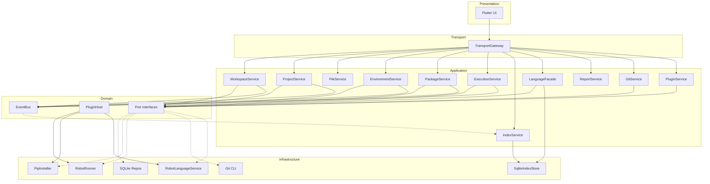
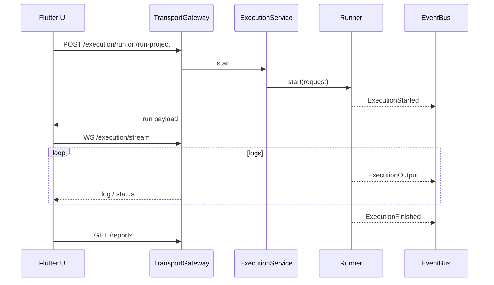
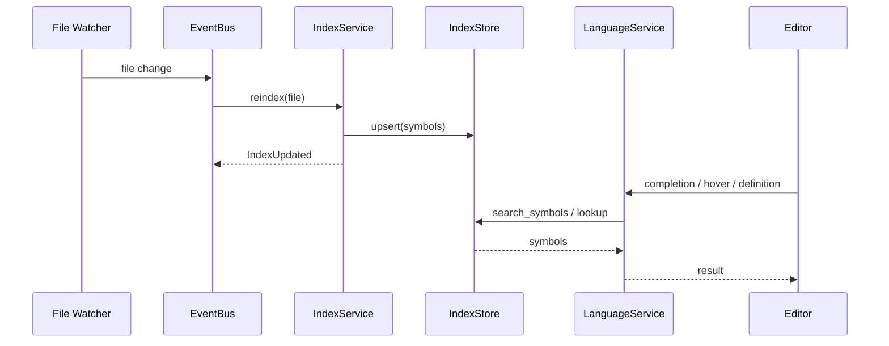

# Robot Studio — Architecture (v2.1)

> A cross-platform desktop IDE for Robot Framework development.

**Status:** Core IDE shipped (workspaces → execution → reports → indexing → **analysis engine** → **Robot Doctor** → language → Git → plugins). Active **usability hardening** against the public-beta review backlog.  
**Last updated:** 2026-08-03 — Robot Analysis Engine (`/api/v1/analysis/*`)

Product snapshot / how to run: [README.md](./README.md)  
Flutter layout: [frontend/README.md](./frontend/README.md)  
E2E suites: [frontend/integration_test/README.md](./frontend/integration_test/README.md)

---

## 1. Overview

Robot Studio follows **clean architecture** with a **Flutter Desktop** frontend and a **Python backend**. Modules communicate through **port interfaces** and an in-process **Event Bus**, not direct calls to concrete implementations. Core features (execution, reports, packages, language, Git, plugins) register through the same **Plugin Host** / capability model that third-party extensions use.

Persistent state lives in **SQLite** under `~/.robot-studio` (configurable). Symbol intelligence (keywords, variables, libraries, suites, references) is served by the **Indexing** subsystem and consumed by the **Language Service**.

```
┌──────────────────────────────────────────────────────────────────────────┐
│                    Flutter Desktop (Presentation)                        │
│  Shell · Explorer · Editor · Git · Reports · Console · Language client   │
└───────────────────────────────┬──────────────────────────────────────────┘
                                │
                    ┌───────────▼───────────--┐
                    │   Transport Gateway     │  ← REST + WebSocket today
                    │   (gRPC hot paths later)│
                    └───────────┬───────────-=┘
                                │
┌───────────────────────────────▼──────────────────────────────────────────┐
│                     API adapters (FastAPI / RestGateway)                 │
└───────────────────────────────┬──────────────────────────────────────────┘
                                │
┌───────────────────────────────▼──────────────────────────────────────────┐
│                     Application Services (Use Cases)                     │
│         orchestrate ports · publish/subscribe via Event Bus              │
└───────────────────────────────┬──────────────────────────────────────────┘
         ┌──────────────────────┼──────────────────────┐
         │                      │                      │
┌────────▼────────┐   ┌────────▼────────┐   ┌────────▼────────┐
│     Domain      │   │   Event Bus     │   │  Plugin Host    │
│ Entities+Ports  │   │  (in-process)   │   │  (capability    │
│                 │   │                 │   │   registry)     │
└────────┬────────┘   └────────┬────────┘   └────────┬────────┘
         │                      │                      │
┌────────▼──────────────────────▼──────────────────────▼──────────────────┐
│                          Infrastructure                                 │
│  SQLite · Index Store · venv · PipInstaller · RobotRunner · Git CLI     │
│  Robot language / parsing bridge · Plugin loader · Report providers     │
└─────────────────────────────────────────────────────────────────────────┘
```

### Design principles

| Principle | Application |
|-----------|-------------|
| **Ports & adapters** | Every external capability (pip, robot CLI, Git, PyPI) sits behind an interface |
| **Event-driven decoupling** | Modules react to lifecycle events instead of calling each other directly |
| **Plugin-ready core** | Built-in features implement the same capability interfaces as future plugins |
| **Index-backed intelligence** | Language Service prefers IndexStore; parsing bridge supplements for live diagnostics |
| **Transport abstraction** | Frontend depends on `TransportGateway`, not raw HTTP |

### Implemented vs planned (summary)

| Area | Status |
|------|--------|
| Workspaces, projects, files | **Shipped** |
| Environments, packages | **Shipped** |
| Indexing + search (incl. BuiltIn keywords) | **Shipped** |
| Language (completion, hover, definition, refs, diagnostics, format, symbols) | **Shipped** (REST) |
| Execution + WebSocket log stream | **Shipped** |
| Reports | **Shipped** |
| Git source control | **Shipped** |
| Plugin manager + builtin/user load | **Shipped** (sandboxing still evolving) |
| **Robot Analysis Engine** (semantic graphs + query APIs) | **Shipped** (backend infrastructure — no UI) |
| Settings / AI assistant UI | **Not shipped** (both hidden from the rail until ready — no stub surfaces) |
| Robot Doctor / Impact Analysis / Safe Rename (UI) | **Doctor shipped** (Project Health Center); Impact / Safe Rename **Planned** |
| Integrated Terminal (bottom panel PTY) | **Shipped** — `xterm` + `flutter_pty`, cwd = project folder; macOS App Sandbox disabled so shells can spawn |
| Desktop packaging: auto-start bundled backend sidecar | **Shipped (closed beta)** — PyInstaller freeze + Flutter `BackendHost` spawns sidecar from the `.app` / `.exe` bundle, health-waits, stops on quit; `make package-macos` / `package-windows` |
| gRPC Language Service sidecar | **Planned** |
| Full plugin subprocess sandbox (P2) | **Planned** |

---

## 2. Cross-Cutting Subsystems

### 2.1 Event Bus

An **in-process publish/subscribe bus** on the backend decouples modules.

```
Publisher                  Event                        Subscribers (examples)
─────────                  ─────                        ─────────────────────
WorkspaceService    →  WorkspaceOpened           →  IndexService
EnvironmentService  →  EnvironmentActivated      →  Index / package consumers
PackageService      →  PackageInstalled          →  IndexService (re-index libs)
IndexService        →  IndexUpdated              →  Language cache invalidation
Execution / Runner  →  ExecutionStarted/Output/… →  Results, reports, UI stream
GitService          →  CommitCreated / Branch…   →  UI refresh paths
PluginHost/Service  →  PluginLoaded / Enabled…   →  Manager UI / capability refresh
```

**Contract:**

```python
class EventBus(ABC):
    async def publish(self, event: DomainEvent) -> None: ...
    def subscribe(self, event_type: type[DomainEvent], handler: EventHandler) -> Subscription: ...
```

**Rules:**

- Application services **publish** events after successful state changes.
- Subscribers **must not** call back into the publisher synchronously (avoid cycles).
- Subscribers may schedule async work (e.g. index rebuild) on a background task.
- The frontend does **not** connect to the Event Bus directly — it receives filtered streams through the Transport Gateway (execution WebSocket + workspace events WebSocket).

Concrete event types live in `backend/robot_studio/core/events.py` (`WorkspaceOpened`, `ExecutionFinished`, `IndexUpdated`, `IndexProgress`, `AnalysisProgress`, `FilesystemChanged`, `PluginLoaded`, Git events, etc.).

**Live workspace fan-out (Tier 1 — shipped):**

```
NativeFileWatcher / PollingFileWatcher
        ↓ on_fs_change (all non-skipped files/dirs) + on_change (indexable)
EventBus (FilesystemChanged, IndexUpdated, IndexProgress, AnalysisProgress, RepositoryUpdated, …)
        ↓
WorkspaceEventService → WS /api/v1/workspace/events
        ↓
Flutter WorkspaceEventStreamClient → WorkspaceLiveController
        ↓
Explorer (incremental) · Editor conflict UX · Git (300ms debounce) · Tests · Search/index · StatusBar (+ soft progress overlay)
```

Wire event types: `FILE_CREATED|DELETED|MODIFIED|RENAMED`, `DIRECTORY_CREATED|DELETED|RENAMED`, `PROJECT_CHANGED`, `WORKSPACE_CHANGED`, `INDEX_UPDATED`, `INDEX_PROGRESS`, `ANALYSIS_PROGRESS`, `GIT_CHANGED`, `ENVIRONMENT_CHANGED`.

**Root liveness**: deleting the watched root itself yields no watcher events (watchdog loses the directory it observes; the poller skips absent roots), so `WorkspaceEventService` also polls the workspace/project roots every ~2s and emits `WORKSPACE_CHANGED` / `PROJECT_CHANGED` with `reason: "missing"`. A missing workspace suppresses the project event so standalone projects raise one dialog, not two. Workspace and project identity is durable under `.robotstudio/` (`workspace.json` / `project.json` UUIDs) — never derived from the filesystem path. Standalone projects use one UUID (`workspace.id == project.id`). On missing root, environment and execution-run registry rows for that workspace id are purged as artifact hygiene; on `WorkspaceOpened`, absolute env/report paths are relocated when the folder moved, then missing-artifact rows are purged. Complementing this, `FileService` mutations refuse to run when the root is gone — writes create missing parents, so without that guard the next save would silently resurrect an externally deleted project.

---

### 2.2 Plugin System

Core features and third-party extensions share one **capability registry** / plugin manager.

```
┌─────────────────────────────────────────────────────────┐
│                      Plugin Host / Manager               │
│  discover · load · enable/disable · capability routing   │
└────────────┬────────────────────────────────────────────┘
             │ registers
   ┌─────────┼─────────┬─────────────┬──────────────┐
   ▼         ▼         ▼             ▼              ▼
Runner   ReportProv  Installer   LanguageService   AIProvider
(builtin) (builtin)  (pip)       (builtin)        (future)
```

**Capability interfaces** (plugins implement one or more):

| Capability | Interface | Built-in default |
|------------|-----------|------------------|
| Test runner | `Runner` | Subprocess / Robot CLI runner |
| Results / history | `ResultsStore` (via execution/report path) | SQLite + output.xml ingestion |
| Report viewer | `ReportProvider` | Builtin HTML report provider |
| Package installer | `Installer` | `PipInstaller` |
| Language intelligence | `LanguageService` | `RobotLanguageService` (+ parsing bridge) |
| AI assistant | `AIProvider` | none yet |

**Loading phases:**

| Phase | Scope | Status |
|-------|--------|--------|
| **P0** | Interfaces + register built-ins | **Done** |
| **P1** | Bundled / workspace / user plugins via manifest + loader | **In progress / shipping** |
| **P2** | Hardened subprocess sandbox for untrusted plugins | **Planned** |

Application services should resolve capabilities through the host/registry — not import concrete runners/installers ad hoc when a capability exists.

---

### 2.3 Indexing Subsystem

Central store for **symbol intelligence**. Keyword Explorer, search, and Language Service read from here.

```
┌──────────────────────────────────────────────────────────────┐
│                       Index Service                           │
│  orchestrates indexers · rebuild · status · search merge      │
└───────┬──────────────┬──────────────┬─────────────────────────┘
        │              │              │
┌───────▼──────┐ ┌─────▼─────┐ ┌──────▼──────┐
│ RobotIndexer │ │ Python    │ │ FileWatcher │
│ (.robot)     │ │ Indexer   │ │ (mtime)     │
└───────┬──────┘ └─────┬─────┘ └──────┬──────┘
        └──────────────┴──────────────┘
                              │
                    ┌─────────▼─────────┐
                    │  SqliteIndexStore  │
                    └───────────────────┘
```

**Indexed entities (current):** keywords, variables (including top-level keys from `.yaml`/`.yml` variable files), libraries, resources, test suites / cases, settings/tags/docs as applicable. **BuiltIn** Robot Framework keywords are merged into search/status so explorers are useful even when a suite only calls libraries. Tag search collapses duplicate tag names and shows usage counts.

**Update triggers:** workspace/project open, file changes, package/environment changes, explicit rebuild (`POST /index/rebuild`).

---

### 2.4 Robot Analysis Engine (semantic platform)

A **backend-only** semantic layer sits beside IndexStore. It builds a queryable workspace model for future Robot Doctor, Impact Analysis, Safe Rename/Delete, dependency views, Replay, Metrics, and grounded AI — **without UI**.

```
IndexService / FilesystemIndexer (incremental)
        ↓ robot.api.parsing ModelVisitor (semantic_extractor)
SqliteAnalysisStore  (entities + edges + graph version)
        ↓ SemanticBinder (confidence: exact|high|medium|low)
RobotAnalysisEngine  (graph queries)
        ↓
InspectionEngine     (pluggable inspections → Finding[])
        ↓
AnalysisService ← REST /api/v1/analysis/*
```

**Entities (stable IDs):** keyword, test_case, variable, resource, library, suite, tag, file — each with file/line/column/docs.

**Edges:** `calls`, `imports_resource`, `imports_library`, `imports_variables`, `references_variable`, `tagged`, `contains` — every edge carries **`confidence`**: `exact` | `high` | `medium` | `low` (Safe Rename should refuse `low`).

**Graph versioning:** snapshot exposes `graph_version` (new on full rebuild), `incremental_revision` / `epoch` (bumps on ingest/rebind), and `timestamp`. Replay / AI / Impact can pin which graph a run belonged to.

**Inspection Engine (Doctor-ready):** inspections return uniform **`Finding`** rows — not feature-specific DTOs. Built-ins: `unused_keyword`, `unused_resource`, `duplicate_keyword`, `missing_import`, `circular_dependency`, `large_keyword`. Register more without new REST shapes.

**REST surface:**
- Lifecycle: `GET /analysis/snapshot`, `POST /analysis/rebuild`
- Inspections: `GET /analysis/inspections`, `POST /analysis/inspect`, `GET /analysis/inspect/{id}`
- Graph queries (Impact/Rename/AI): `/analysis/graph/*` (callers, callees, dependency, affected-tests, variable-references, library-usage, keyword-usage-statistics)

**Performance:** facts update per changed `.robot`/`.resource` during indexing; bulk rebuilds defer binder finalize once per project; query results cache until revision bump.

**Extension points:** new `Inspection` classes; **Execution Knowledge Layer** (below); Finding severity policies for Doctor UI.

---

### 2.4.1 Execution Knowledge Layer

Links `output.xml` (+ run history) onto **existing** semantic entity IDs — never duplicates symbols.

```
RunIndexed / POST /analysis/execution/link/{run_id}
        ↓
parse_execution_trace(output.xml)   # suite → test → kw tree + elapsed/status
        ↓
ExecutionLinker  (bind test/kw/suite → AnalysisStore entities)
        ↓
SqliteExecutionKnowledgeStore
  · execution_entity_stats   (counts, durations, last_*)
  · execution_history        (per run × entity)
  · execution_edges          (executed_keyword, failed_keyword, suite_execution, execution_graph)
  · execution_linked_runs    (run ↔ graph_version)
        ↓
ExecutionKnowledgeService ← REST /analysis/execution/*
```

**Queries:** keyword/test history, last failures, slowest keywords/tests, most-executed keywords, never-executed keywords, heat map, flaky candidates (deterministic heuristics + confidence).

**FindingProviders (Doctor):** `flaky_test`, `slow_keyword`, `never_executed_keyword` — registered under Full profile; consume this service only.

---

### 2.4.2 Robot Doctor (Project Health Center)

Orchestration + presentation over Analysis / Inspections / Execution Knowledge. Doctor **does not** re-analyze sources.

```
POST /doctor/run (profile: quick|default|full)
        ↓
DoctorService
  · select FindingProviders for profile
  · collect Findings (adapters over Inspections + execution providers)
  · merge / prioritize / group by category
  · health summary (counts + optional improvement trend)
  · persist report → SqliteDoctorStore
        ↓
GET /doctor/report/{id} · GET /doctor/history · GET /doctor/profiles
        ↓
Flutter DoctorPage (activity rail — not Problems panel)
```

**Categories:** correctness · maintainability · performance · dependencies · execution · style  
**Severity:** error · warning · info · hint  
**Quick Fix metadata** on every finding (`supports_fix`, `fix_id`, `estimated_risk`, `confidence`) — fixes themselves are **not** implemented yet.

**Health summary:** total findings, by severity, by category, critical issues, improvement trend vs previous report — **no invented percentage score**.

---

### 2.5 Transport Layer (REST vs gRPC)

#### Current (Phase 1 — **active**)

| Channel | Use |
|---------|-----|
| **REST** `/api/v1/...` | CRUD, commands, language, index, git, plugins, reports |
| **WebSocket** `/api/v1/execution/stream` | Execution status + log fan-out |
| **WebSocket** `/api/v1/workspace/events` | Live FS / index / git / env / workspace fan-out (**Tier 1 shipped**) |

#### Planned (Phase 2+)

| Channel | Use |
|---------|-----|
| **gRPC** sidecar | High-frequency language + optional streaming events |
| REST | Retained for CRUD / tooling / curl debugging |

**Frontend contract:** Flutter depends on `TransportGateway` (`RestTransportGateway` today). Swapping hot paths to gRPC should not require rewriting presentation widgets.

```dart
abstract class TransportGateway {
  // Workspace, project, env, packages, execution, reports,
  // index/search, language, files, git, plugins, …
  Stream /* execution */ …;
}
```

---

## 3. Module Catalog

### Core feature modules

| Module | Responsibility | Key ports / services | Status |
|--------|----------------|----------------------|--------|
| **workspace** | Create/open/recent | `WorkspaceRepository`, `WorkspaceService` | Shipped |
| **project** | Create/import/open | `ProjectRepository`, `ProjectService` | Shipped |
| **files** | Workspace-scoped read/write/tree | `FileService` | Shipped |
| **environment** | venv lifecycle, interpreters | `EnvironmentRepository`, env manager | Shipped |
| **packages** | PyPI search, install/update/uninstall | `PackageRegistry`, `Installer` | Shipped |
| **search** | Symbol search UI (keywords, variables, libraries, …) | reads `IndexStore` | Shipped |
| **indexing** | Rebuild, status, incremental index | `IndexStore`, indexers | Shipped |
| **analysis** | Semantic graphs + inspections + execution knowledge | `AnalysisStore`, `InspectionEngine`, `ExecutionLinker` | Shipped |
| **doctor** | Project Health Center (FindingProviders → report) | `DoctorService`, `FindingProvider` | Shipped |
| **language** | Editor intelligence | `LanguageService` | Shipped |
| **execution** | Run file/project, stop, history, stream | `Runner`, execution service | Shipped |
| **tests** | Test Explorer discover/run (suite/test/tag/failed) | `TestExplorerService` + IndexStore + Runner | Shipped |
| **reports** | Dashboard, artifacts, open/reveal | `ReportProvider`, report service | Shipped |
| **git** | Status, stage/commit, branches, remotes, diff | `GitProvider` / CLI | Shipped |
| **plugins** | List/enable/disable/reload | Plugin host/manager | Shipped |
| **settings** | App preferences | — | Stub / later |
| **AI** | Assistant surface | `AIProvider` | Not shipped |

### Execution domain

```
┌─────────────┐     execution events        ┌──────────────┐
│   Runner    │ ─────────────────────────► │   Results    │
│ start/stop  │     output stream           │ parse/store  │
│ stream logs │                            │ history      │
└─────────────┘                            └──────┬───────┘
                                                   │
                                           ┌───────▼───────┐
                                           │ ReportProvider │
                                           │ HTML artifacts │
                                           └───────────────┘
```

| Port | Responsibility |
|------|----------------|
| **`Runner`** | Build robot command, spawn subprocess, stream output, stop |
| **Results / history** | Persist run records, pass/fail aggregates |
| **`ReportProvider`** | Locate/serve `log.html`, `report.html`, etc. |

### Language Service

| Capability | Status |
|------------|--------|
| Autocomplete | Shipped |
| Diagnostics | Shipped |
| Hover | Shipped |
| Go to definition / references | Shipped |
| Document / workspace symbols | Shipped |
| Format / signature help | Shipped (hover tooltip near pointer; env libdoc args/docs) |
| robotframework-lsp swap | Optional future via PluginHost |

Implementation uses IndexStore plus a **Robot parsing bridge** (workspace-venv worker) for fidelity with Robot Framework parsing.

The Flutter editor uses gateway language methods — no Robot parsing in Dart.

### Packages — Installer abstraction

```
PackageService
   ├──► PackageRegistry (PyPI search, versions)
   └──► Installer (PipInstaller today; uv/poetry later)
```

Publishes package install/update/remove events; does not call Indexing directly.

### Git

**Project-scoped** Git via CLI provider: `detect()` only claims a repository when `.git` lives on the active project path (or the path itself is the Git toplevel). Nested projects under a parent monorepo are treated as not-a-repository so Source Control never silently attaches to an unrelated parent — Init creates a repo inside the open project (or the user opens the parent folder as the project). Status, commit, branches, history, diff, fetch/pull/push, plus `POST /git/seed-local-remote` (bare remote under the workspace for integration GT-10). Remote actions are UI-gated when the folder is not a repository.

### Large-run confirmation

`TestExplorerService` / `ExecutionService` gate project-wide and tag runs when the estimated test count exceeds `settings.large_run_threshold` (env `ROBOT_STUDIO_LARGE_RUN_THRESHOLD`, default **100**), or when the tag expression is a wildcard/boolean include. Without `confirm: true`, APIs return **409** with `{code: large_run_confirmation_required, count, threshold, message}`. The Flutter shell pre-counts via `GET /tests/count`, shows the estimate, and retries with `confirm: true`.

---

## 4. Dependency Diagrams

### 4.1 Module dependency graph (allowed directions)



**Forbidden:** Infrastructure → Application; IndexStore → PackageService; Runner → ReportProvider without events/services.

### 4.2 Execution flow



### 4.3 Indexing + Language Service flow



---

## 5. Folder Structure (as implemented)

```
robot-studio/
├── ARCHITECTURE.md
├── README.md
├── scripts/
│   └── run_integration_tests.sh
├── backend/
│   ├── pyproject.toml
│   ├── tests/
│   └── robot_studio/
│       ├── main.py
│       ├── core/
│       │   ├── config.py
│       │   ├── container.py
│       │   ├── events.py
│       │   └── plugins.py
│       ├── domain/
│       │   ├── models/
│       │   └── interfaces/          # workspace, project, environment,
│       │                            # installer, runner, language, indexing,
│       │                            # git, plugins
│       ├── application/
│       │   └── services/            # workspace, project, file, environment,
│       │                            # package, execution, index, language,
│       │                            # report, git, plugin, workspace_context,
│       │                            # workspace_event_service, test_explorer
│       ├── infrastructure/
│       │   ├── repositories/
│       │   ├── indexing/            # FileWatcher (index + live FS channels)
│       │   ├── analysis/            # Semantic extractor, binder, graph store, engine
│       │   ├── language/            # Robot parsing bridge / language service
│       │   ├── language/            # RobotLanguageService, parsing bridge/worker
│       │   ├── execution/
│       │   ├── environment/
│       │   ├── packages/
│       │   ├── git/
│       │   ├── plugins/
│       │   ├── project/
│       │   └── workspace/
│       └── api/
│           ├── router.py
│           ├── gateway.py           # RestGateway
│           ├── routes/              # health, workspaces, workspace_events,
│           │                        # projects, environments, packages,
│           │                        # execution, reports, index/search,
│           │                        # language, files, git, plugins, tests
│           └── schemas/
└── frontend/
    └── lib/
        ├── core/
        │   ├── gateway/             # TransportGateway, RestTransportGateway,
        │   │                        # execution + workspace event stream clients
        │   ├── config/
        │   ├── api/
        │   ├── logging/
        │   └── theme/
        └── presentation/
            ├── shell/               # AppShell, status bar, live/workspace controllers
            ├── sidebar/ · toolbar/ · panels/
            ├── workspace/ · project/ · environment/ · packages/
            ├── editor/ · search/ · execution/ · reports/
            ├── git/ · plugins/
            └── widgets/             # empty state, error dialog, guidance dialog, tree, badges, …
```

---

## 6. Data Models (selected)

### Indexed symbols

```python
IndexedSymbol:
  id: str
  project_id: UUID | None
  workspace_id: UUID | None
  kind: keyword | variable | library | resource | test_suite | test_case | …
  name: str
  file_path: str
  line: int
  documentation: str | None
  detail: str | None
```

BuiltIn keywords may appear as synthetic search hits (`file_path = "BuiltIn"`) merged by `IndexService`.

### Execution

```python
RunRequest / run file|project
ExecutionResult:
  id, status, suite, project, timestamps, exit_code, passed/failed counts, output paths
```

### Plugin

```python
PluginManifest: id, version, name, provides…
PluginState: enabled, loaded_at, error…
```

### Language DTOs

Completion, hover, diagnostics, definition/references locations, format edits, signature help, document/workspace symbols — exposed via `/language/*`. Completions and catalogs **separate RF DSL** (section headers, suite/local settings, control-flow: `IF`/`FOR`/`TRY`/`VAR`/… — completion kind `dsl`) from **BuiltIn library** keywords (`Log`, `Should Be Equal`, … — kind `keyword`). Completions also include keywords from `Library` imports in the current file, resolved against the **active environment** via Robot `libdoc` (including `WITH NAME` → `Alias.Keyword` suggestions). Semantic diagnostics resolve `Library` imports (and their keywords) the same way, skip continuation rows (`...`), treat RF automatic / number variables as known, and track variables declared by assignments / `FOR` / `VAR` / `[Arguments]` plus same-file user keywords. Missing Resource/Variables imports are enriched from the Analysis Engine (`source: analysis`, `code` / `inspection_id: missing_import`) so Problems and Doctor share finding identity. Go to Definition resolves the Robot cell under the caret (content + line/column), falls back to the Analysis Engine graph, and returns `definitions[]` when multiple matches exist. Signature help is shown as a pointer hover tooltip.

---

## 7. API Design (as implemented)

Base URL: `http://127.0.0.1:{port}/api/v1` (default port **8765**)

Paths below are relative to `/api/v1`. Workspace context is typically **session-scoped** on the backend (open workspace) rather than always embedded in the URL.

### REST (representative)

| Method | Path | Module |
|--------|------|--------|
| GET | `/health` | core |
| POST | `/workspaces`, `/workspaces/open` | workspace |
| GET | `/workspaces/recent` | workspace |
| POST | `/projects`, `/projects/standalone`, `/projects/import`, `/projects/open`, `/projects/open-path` | project |
| GET | `/projects`, `/projects/recent` | project |
| GET/PUT | `/files/content` | files |
| POST | `/files/create`, `/files/mkdir`, `/files/rename`, `/files/move`, `/files/duplicate`, `/files/delete` | files (Explorer mutations; publish `FilesystemChanged`) |
| GET | `/files/tree` | files (`depth` default **0**, `has_children` for lazy expand) |
| GET/POST | `/environments`, `/environments/import`, `/environments/activate`, … | environment |
| GET | `/environments/interpreters` | environment |
| GET/POST | `/packages`, `/packages/search`, `/packages/install`, … | packages |
| POST | `/execution/run`, `/execution/run-project`, `/execution/stop` | execution (pre-validates Robot Framework; stop is idempotent; aborted startups are discarded) |
| GET | `/execution/history`, `/execution/status` | execution (history omits `aborted`) |
| GET | `/tests/tree`, `/tests/file`, `/tests/count` | tests (`tree` defaults `lazy=true`; expand via `/tests/file`; `count` for large-run confirm) |
| POST | `/tests/run`, `/tests/run-suite`, `/tests/run-tag`, `/tests/run-failed`, `/tests/run-selected` | tests |
| GET | `/reports`, `/reports/dashboard`, `/reports/{id}` | reports |
| POST | `/reports/{id}/open-log`, `open-report`, `open-xml`, `reveal` | reports |
| POST/GET | `/index/rebuild`, `/index/status` | index |
| GET | `/search` | search |
| GET/POST | `/analysis/snapshot`, `/rebuild` | analysis lifecycle + graph version |
| GET/POST | `/analysis/inspections`, `/inspect`, `/inspect/{id}` | Inspection Engine → Finding[] |
| GET/POST | `/analysis/graph/*` | callers, callees, dependency, affected-tests, variable-references, library-usage, keyword-usage-statistics |
| GET/POST | `/analysis/execution/*` | execution knowledge (history, slowest, heat-map, flaky-candidates, link run) |
| GET | `/doctor/profiles` | Doctor profiles + FindingProvider catalog |
| POST | `/doctor/run` | Run Doctor (profile / optional provider override) |
| GET | `/doctor/report/{id}` | Fetch persisted Doctor report |
| GET | `/doctor/history` | Prior Doctor reports for active project |
| GET/POST | `/language/definition`, `hover`, `references`, `completion`, `diagnostics`, `format`, `signature-help`, `document-symbols`, `workspace-symbols` | language |
| GET/POST | `/git/status`, `init`, `commit`, `branches`, `checkout`, `diff`, `fetch`, `pull`, `push`, `seed-local-remote`, … | git |
| GET/POST | `/plugins`, `/plugins/refresh`, `enable`, `disable`, `reload` | plugins |

### WebSocket

| Path | Content |
|------|---------|
| `/api/v1/execution/stream` | Execution status + output lines |

### gRPC (Phase 2 — planned)

Language hot paths and optional event streams. REST language endpoints remain until a Flutter gRPC client is wired.

---

## 8. Design Decisions

| Decision | Rationale | Notes |
|----------|-----------|-------|
| Event Bus over direct calls | Prevents install → reindex → UI coupling chains | Shipped |
| Split Runner / Results / ReportProvider | Independent lifecycles; reports pluggable | Shipped |
| Installer interface | pip is an implementation detail | Pip shipped; uv later |
| IndexStore as symbol source | One rebuild pipeline | BuiltIns merged for UX |
| Language Service as module | Editor intelligence stays cross-cutting | REST + parsing bridge |
| PluginHost early | Built-ins register like plugins | Manager UI shipping |
| REST now, gRPC later | Velocity + curl debugging | gRPC deferred |
| TransportGateway in Flutter | Transport swap without UI rewrite | Shipped |
| Workspace session on backend | Simplifies desktop single-user API | Documented constraint |
| Guidance dialogs in UI | Soft next-steps vs dead error modals | Presentation concern |

---

## 9. Scalability & Risk

| Risk | Mitigation |
|------|------------|
| Index rebuild on large projects | Incremental indexers, mtime tracking, debounce |
| Event Bus handler failures | Isolate handlers; log without blocking publish |
| Plugin misbehavior | Evolve toward P2 sandbox; validate manifests |
| REST latency for completion | Cache IndexStore; optional gRPC later |
| Dual parsing (index vs robot.api) | Prefer parsing bridge for diagnostics; keep index for search |
| Large file trees / venv noise | Explorer filters (e.g. skip site-packages outside `.robotstudio/`) + lazy depth-0 expand |
| Circular event loops | Subscribers publish *new* event types only |

Engineering audit notes: [audit.md](./audit.md).

---

## 10. Implementation Milestones

| Milestone | Scope | Status |
|-----------|--------|--------|
| **M1** | Architecture doc, app shell, backend skeleton, health API | ✅ Done |
| **M1.5** | Architecture v2 (Event Bus, Plugin Host, Indexing, transport) | ✅ Done |
| **M2** | Workspace create/open/recent, welcome, explorer | ✅ Done |
| **M3** | Project create/import, details, recent (no template types) | ✅ Done |
| **M4** | Environment manager; activation events | ✅ Done |
| **M5** | PackageRegistry + PipInstaller; package events | ✅ Done |
| **M6** | Indexing pipeline; Keyword/Search UI; Language Service (completion + hover + more) | ✅ Done |
| **M7** | Runner + history + WebSocket log stream | ✅ Done (gRPC migration deferred) |
| **M8** | ReportProvider + reports UI | ✅ Done |
| **M9** | Settings, packaging polish, AI provider | 🔶 Partial (Settings hidden; AI deferred; **desktop packaging shipped** for closed beta) |
| **M10** | Intelligent editor (parsing bridge, diagnostics, navigation) | 🔶 Shipping |
| **M11** | Plugin framework + manager UI | 🔶 Shipping |
| **M12** | Git source control | 🔶 Shipping |
| **M13** | Test Explorer (discover/run suites, tests, tags, failed) | ✅ Done |
| **Pre-M14** | Workspace Explorer file ops (create/rename/delete/duplicate/move/reveal) | ✅ Done |
| **UX** | Public-beta usability backlog (status, reports, guidance, terminology, …) | 🔶 In progress |

---

## 11. Migration from v1 Architecture

**Status: complete** (structural refactor at M1.5).

| Area | v1 | v2 |
|------|----|----|
| `domain/interfaces/` | Monolithic | Split per-port modules |
| `core/container.py` | Empty | Wires EventBus, PluginHost, WorkspaceContext, services; `shutdown()` stops Git/Index background work and closes the workspace context |
| `core/events.py` | Missing | EventBus + DomainEvent types |
| `core/plugins.py` | Missing | PluginHost + registry |
| `api/gateway.py` | Missing | `RestGateway` |
| Frontend transport | Direct HTTP | `TransportGateway` + `RestTransportGateway` |

---

## 12. Presentation concerns (non-domain)

Not domain architecture, but product-facing constraints that affect shell design:

- **Project-first UX, workspace-backed domain**: `WorkspaceContext` still owns workspace + project + environment. **Open Project** / **New Project** initialize `.robotstudio/` inside the selected folder (the folder *is* the workspace root). Studio-managed envs and run output live under `.robotstudio/environments/` and `.robotstudio/reports/` (legacy root `Environments/` / `Reports/` remain readable for older projects). No companion `project-workspaces/` wrappers. Classic multi-project workspaces remain available under Advanced (**Open/New Workspace**).
- **Fast open**: open-path returns as soon as metadata is ready; environment creation is never awaited on the critical path. Missing envs surface a compact bottom-right toast titled **Python environment required** (Create Environment / Select Existing; dismiss with ✕), with detection for `.venv` / `venv` / `env` / `.robotstudio/environments/*` (and legacy `Environments/*`).
- **Background indexing**: `WorkspaceOpened` schedules an incremental index rebuild and returns immediately (VS Code-style). Explicit **Rebuild Index** still runs a full rebuild and waits. Discovery prunes `.venv` / `node_modules` / `.git` / `.robotstudio` / etc. Robot parsing runs off the event loop; bulk rebuilds do not emit per-file `FileIndexed` events.
- **Large projects**: explorer uses VS Code-style lazy expand (`GET /files/tree` default `depth=0` + `has_children`) and a virtualized flat list so only visible rows are built. Heavy dirs (`.venv`, `.git`, `node_modules`, …) are skipped; other dotfiles (`.gitignore`, …) are shown, and `.robotstudio/` is fully browsable (no filtering inside it, so envs and run output can be inspected in-tree). Git status includes untracked files (`-uall` so files inside new folders appear; `.gitignore` still hides ignored paths like `.venv`).
- **Explorer mutations**: create/rename/delete/duplicate/move publish `FilesystemChanged` from `FileService`; UI updates via the live workspace pipeline (parent-only refresh). Inline rename and create avoid dialogs except delete confirmation.
- **Test Explorer** (Tests rail): hierarchical workspace → project → suite → test/task tree with status, live filter, and run actions (all / current file / failed / node). Discovery uses IndexStore + `robot.api` document symbols; runs reuse `ExecutionService` / `Runner`.
- **Actionable guidance** for missing project/environment (primary buttons prefer Open/New Project).
- **Status chrome**: project name; `ROBOT` / full `PYTHON major.minor.micro` from the active environment in the status bar (no CONNECTED/OFFLINE label); toolbar context shows **project name** (plus branch • environment), not the workspace name unless multiple projects are open. Health is probed on launch, then every 2s while offline and 15s while connected; three consecutive failures are required before disconnecting the execution stream.
- **Toolbar layout**: left context (project chip / environment / branch, with git Fetch·Pull·Push in a ⋯ menu shown only for repositories), centered command search, right **Run** (primary, labelled) plus icon-only Run Project and Stop. No product wordmark; profile and notifications deferred.
- **Editor chrome**: the permanent strip carries editing verbs only (Save, Save All, Format, Find) plus a word-wrap toggle. Language navigation (Definition, Peek, References, Hover, Go to Symbol in File, Find Symbol in Project, Replace, Format Selection, Reveal) is reachable through the editor ⋯ menu and the command palette, matching VS Code / PyCharm chrome discipline.
- **Rail ownership**: only Explorer, Tests, and Reports render side-rail content (`SidePanel.hasSideContent`); Search, Packages, Plugins, and Source Control own the main view and the rail collapses. Bottom panel exposes Console / Terminal / Problems. Run output is on the Tests view; Terminal is a real PTY (`xterm` + `flutter_pty`) rooted at the project folder, so the macOS app ships **unsandboxed** (App Sandbox blocks spawning a shell). Shell shortcuts live in `shell_shortcuts.dart` (palette, save, tabs, sidebar, terminal, project search, format, Problems); editor chords use re_editor defaults plus `RobotCodeShortcutsActivatorsBuilder` (VS Code delete-line / replace) and `#` comment formatting for `.robot` / `.resource`.
- **Empty and error surfaces**: `EmptyState` gives every empty view an icon, a reason, and one action; `showFriendlyErrorDialog` maps transport/OS exceptions to a plain sentence plus a suggested fix, hiding raw text behind **Show details**. Dialog widths are limited to `AppDialogWidth.form` / `.wide`.
- **Reports**: Rail Recent list selects a run; main Reports view shows dashboard + details (no second run list). Artifact hyperlinks open output.xml / log.html / report.html.
- **Problems loop**: Diagnostics refresh while editing `.robot` files; Problems panel + status-bar ERRORS/WARNINGS jump to file:line:column.
- **Command palette**: ⌘K (macOS) / Ctrl+K and toolbar search open a filtered command list plus project file/symbol search; full Search page remains on the sidebar Search action.
- **AI** entry points withheld until `AIProvider` ships.
- Usability backlog: [Robot Studio — Public Beta Usability Review.md](./Robot%20Studio%20%E2%80%94%20Public%20Beta%20Usability%20Review.md).

---

## 13. Document maintenance

When architecture, APIs, modules, or milestone status change, update:

1. This file (`ARCHITECTURE.md`)
2. [README.md](./README.md)
3. [frontend/README.md](./frontend/README.md) and/or [frontend/integration_test/README.md](./frontend/integration_test/README.md) when Flutter/E2E surfaces change
